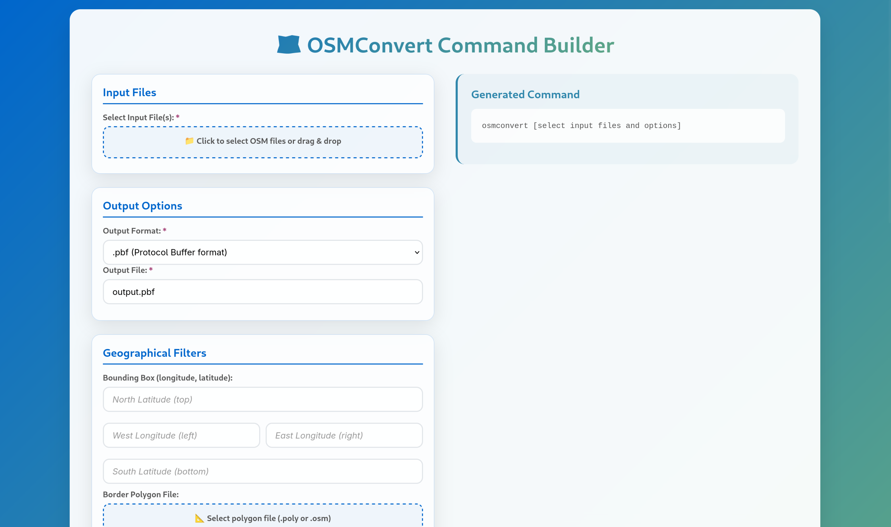

# OSMConvert Command Builder

🗺️ A modern, intuitive web-based GUI tool for generating [osmconvert](https://wiki.openstreetmap.org/wiki/Osmconvert) commands with ease.



## ✨ Features

- **🎨 Modern Design**: Beautiful OSM-themed interface with blue and green gradients
- **📁 Smart File Handling**: Drag & drop support with performance optimization for large files
- **⚡ Live Preview**: Real-time command generation as you configure options
- **🗺️ Geographical Filters**: Intuitive bounding box and polygon file support
- **🔧 Comprehensive Options**: All osmconvert features including advanced memory management
- **📱 Responsive**: Works perfectly on desktop, tablet, and mobile devices
- **💡 Smart Tooltips**: Helpful explanations for complex parameters
- **📋 One-Click Copy**: Easy command copying to clipboard

## 🚀 Quick Start

1. Open `index.html` in your web browser
2. Select your OSM input files
3. Configure output format and options
4. Copy the generated command and run it in your terminal

## 🛠️ Supported Features

### Input/Output
- All OSM formats: `.osm`, `.osc`, `.osh`, `.o5m`, `.o5c`, `.pbf`, `.csv`
- Multiple input file support
- Smart file size display

### Geographical Filtering
- Intuitive bounding box configuration (North/South/East/West)
- Polygon file support (`.poly`, `.osm`)
- Complete ways and multipolygons preservation
- Broken reference handling

### Data Modification
- Author and version information control
- Tag modification with examples
- Fake data generation for compatibility

### Advanced Options
- **Smart Memory Management**: Hash memory configuration with intelligent recommendations
- **Performance Tuning**: Max objects and references configuration
- **Conversion Options**: Ways/relations to nodes conversion
- **Statistics**: Verbose output and processing statistics

## 💾 Memory Management

The tool includes intelligent memory management recommendations:
- Automatically detects system RAM when possible
- Suggests optimal hash memory allocation
- Provides warnings for potentially problematic configurations
- Converts user-friendly GB values to osmconvert's MB format

## 🎯 Performance Optimized

- **Large File Safe**: Only reads filenames, never loads file content (prevents 100GB+ file issues)
- **Efficient Processing**: Smart memory allocation recommendations
- **Fast Interface**: Minimal JavaScript with efficient DOM updates

## 📖 Documentation

For detailed information about osmconvert parameters and usage, see:
- [OSMConvert Wiki](https://wiki.openstreetmap.org/wiki/Osmconvert)
- Built-in tooltips provide context-sensitive help for all options

## 🔧 Example Commands

The tool generates commands like:
```bash
osmconvert input.pbf --out-osm -o=output.osm -b=-74.0,40.7,-73.9,40.8 --complete-ways --drop-author --hash-memory=1200 --verbose
```

## ⚠️ Notice

This personal project is not affiliated with OpenStreetMap or the osmconvert tool. It's a community-created interface to make osmconvert more accessible.

## 🤝 Contributing

Feel free to submit issues, feature requests, or pull requests to improve the tool!
